## MetaLens AI

Talk to ChatGPT, take photos, let AI analyze what you see, and live-stream directly from your Meta Glasses to YouTube or Twitch.

> [!NOTE]
> **Developer Mode** must be enabled in the **Meta** AI app before you start. See [instructions](https://metalensai.com/installation).

> 📥 **Quick download**
> - **Android**: Download the latest [.apk](https://github.com/przemek-nowicki/meta-lens-ai/releases/download/v0.11.0/meta-lens-ai-v0.11.0.apk) on your phone ([see video](https://youtube.com/shorts/QVVm1t4VBfk)),then follow the installation steps below.
> - **iOS**: Work in progress. Follow updates and early access at [metalensai.com](https://metalensai.com/).

## UI Preview

  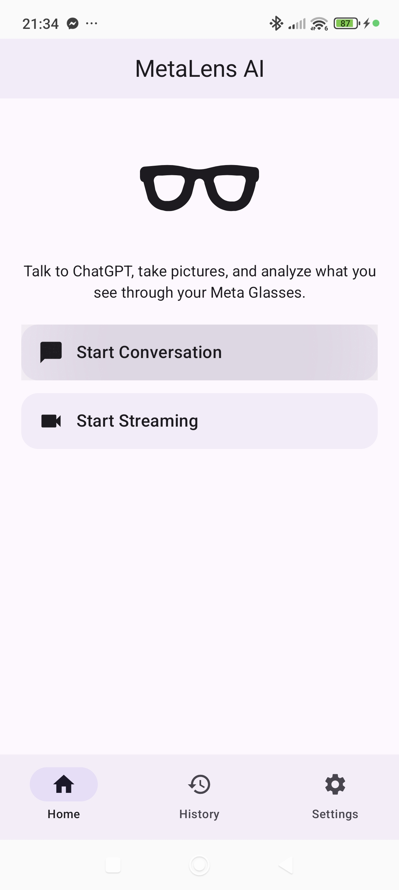
  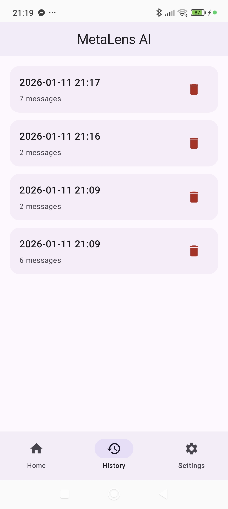
  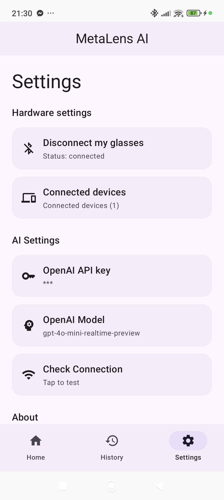
   
  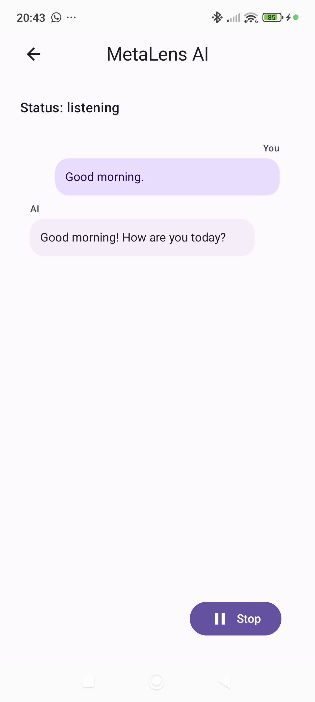
  
  

## Application features

### 
Live-stream what the glasses’ camera sees to YouTube with hands-free control.

[ **Watch demo from live stream**](https://www.youtube.com/live/z6s6ay0wkkM)

### 
Live-stream what the glasses’ camera sees to Twitch with hands-free control.

[
**Watch demo from live stream**](https://www.twitch.tv/videos/2707247644)

### 
Live-stream what the glasses’ camera sees to Kick with hands-free control.

[
**Watch walkthrough how to stream to Kick**](https://www.youtube.com/shorts/VJsQOe5s8-M)

### 🔴 REC
Unlimited-length recordings video on your phone <
[🎥 **See how**](https://www.youtube.com/shorts/fEevqmGu-F8) 

### ✨ Cinematic HUD effects and reactions
Cinematic HUD effects for videos recorded with your Glasses:  
[🤖 See HUD demo](https://youtube.com/shorts/bIiir3f9_d0) 
[🤌 See Live Reactions demo while streaming](https://www.youtube.com/shorts/xmR0GPS_tDk)

> [!TIP]
> For the best streaming experience in MetaLens AI, battery restrictions for the app should be disabled.
> Setting MetaLens AI to **No restrictions** / **Unrestricted** helps prevent the system from limiting 
> background activity, which can cause the stream to pause or disconnect.
> ``Settings → Battery →  MetaLens AI (app must be running) → Battery Saver → No restriction``
>
> Watch this short [walkthrough](https://www.youtube.com/shorts/-JmbuCbm_T8) or [this one](https://youtube.com/shorts/wvCGgyorcVs).  
> In case of any issues, head here: https://metalensai.com/faq/ or contact us: metalensai@gmail.com.

### 👁️ Live Vision AI
Bring real-time scene understanding to Meta glasses. Users can speak naturally, share live visual context from the glasses camera, and receive fast AI responses based on what is happening in front of them. The experience combines live preview, voice conversation, and on-demand image analysis in a single flow.  
[See Live Vision AI with ChatGPT-5 on Meta Ray-Ban Smart Glasses in action.](https://www.youtube.com/shorts/N0stiJMb9BI)

###  Conversation
A hands-free voice conversation with ChatGPT, including a live transcript view.  
[Demo of ChatGPT Voice Control on Meta Smart Glasses](https://www.youtube.com/shorts/5tXmhzA72JI)

### 📸 Picture Analysis
Take a picture and get an on-screen description/analysis of what the glasses camera sees.

### 🕘 History
Review past conversation sessions using your selected ChatGPT model.

### ⚙️ Settings
Connect your smart glasses, choose video quality, and set up ChatGPT and YouTube access.

## Installing MetaLens AI (Important Information)

MetaLens AI uses a new Meta SDK that hasn’t been released to the public yet (expected in Q1 2026). 
For this reason, the app is not available on the Google Play Store or any other app store yet.
To try MetaLens AI, you’ll need to install it manually by downloading the APK file to your Android phone.
You’ll also need to enable Developer Mode in the Meta AI app. Don’t worry this guide explains everything step by step in the next section.

##  Quick Setup Checklist

To run MetaLens AI app, make sure the following checklist is completed:
- Ray-Ban Meta Smart Glasses powered on
- Android 12 or newer installed on your phone
- Stable internet connection
- Bluetooth enabled on your phone
- Meta AI app installed on your phone
- Developer Mode enabled in the Meta AI app ⚠️ 
- Glasses connected to the Meta AI app
- MetaLens AI connected to Meta AI app Settings -> "Connect my glasses" status Connected. Glasses visible on the "Connected devices" list.
- OpenAI API key set in Settings
- Check connection button i AI Settings shows “Connection OK”.
- All the monitos requiring access to camera bluetooth and are confirmed
- More details about the critical points in this list are explained in the instructions below.

## Detailed Installation Steps

Critical Steps to Run MetaLens AI on Your Android Phone is to enable **Developer Mode** 

> [!WARNING]
> **Developer Mode Required**  - Before You Start Instalation MetLens AI
> Your Meta glasses must have **Developer Mode enabled** in the Meta AI app before the MetaLens AI app can connect to them.
>
> **How to enable:**  
> Watch this short [walkthrough](https://www.youtube.com/shorts/v34u_DYSRBM) or follow the steps below:
> 1. Open **Meta AI** app on your phone  
> 2. Go to **Settings** → **App Info**  Note: This is not the glasses settings (found in the top-left ☰ menu, then go to Settings at the bottom of the menu.).
> 3. Tap **App version** number **five times quickly** — this reveals the Developer Mode toggle  
> 4. Enable the **Developer Mode** toggle  
> 5. Tap **Enable** to confirm
>
> 
>
> See [Meta Wearables Setup Guide](https://wearables.developer.meta.com/docs/getting-started-toolkit) for detailed instructions.

## Download the MetaLens .APK file to your phone.
> No Google Play Store - installation from APK (see why above) 
> Download .APK file

Example installation screens on a Xiaomi Poco F6:

  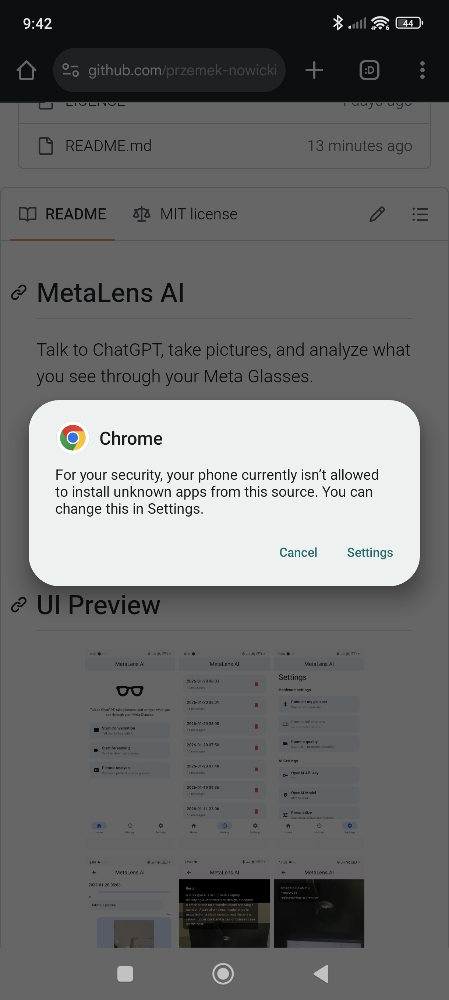
  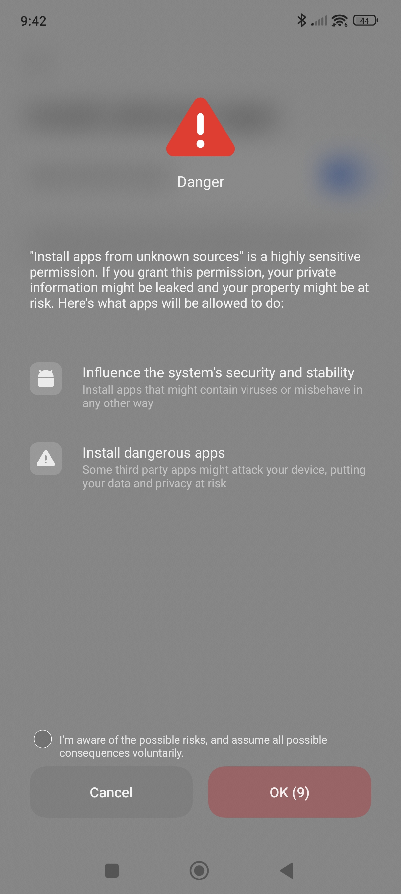
  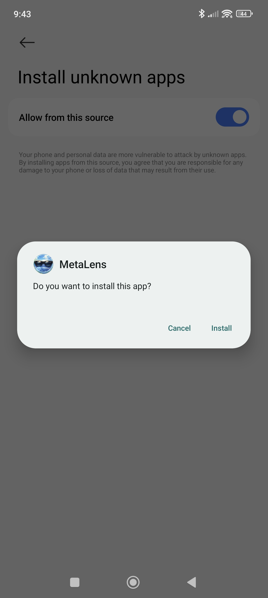
  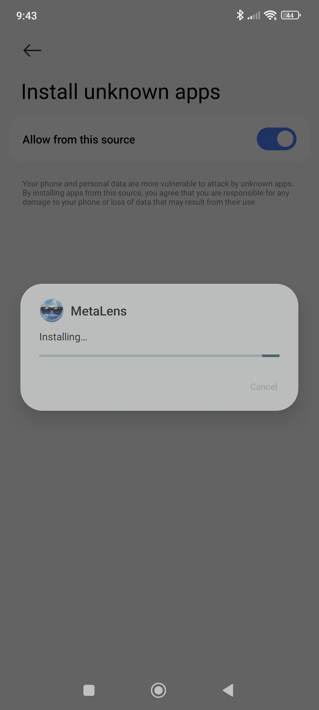
   
  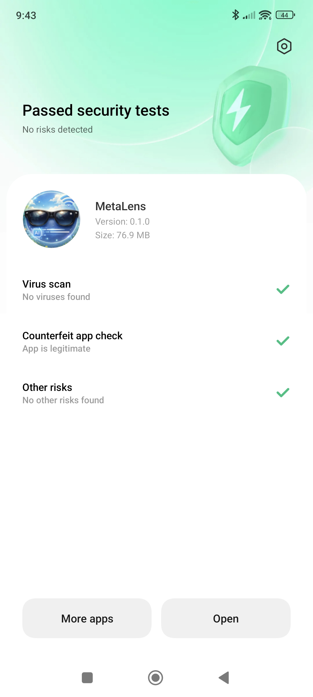
  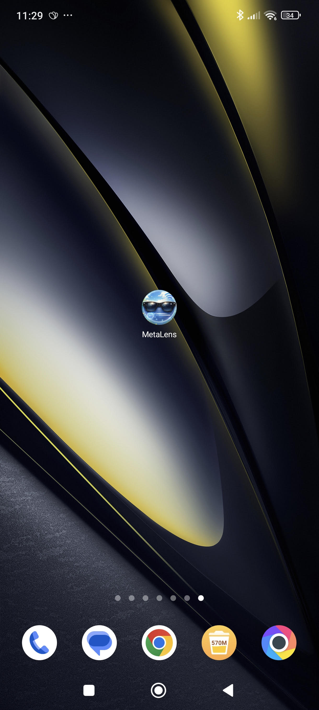
  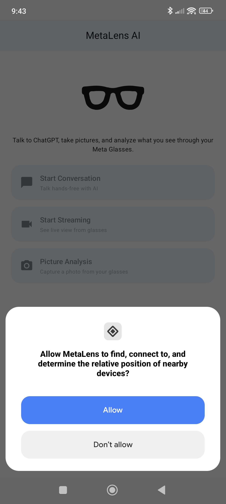
  

1. Open this page on your phone and tap the [.apk](https://github.com/przemek-nowicki/meta-lens-ai/releases/download/v0.11.0/meta-lens-ai-v0.11.0.apk) download. When prompted, choose Settings to allow installs from this source.
2. Read the warning and confirm you understand the risk.
3. Toggle **Allow from this source** to ON.
4. Confirm the **Install** prompt for MetaLens and wait for installation to finish.
5. After the security scan, tap **Open** (or find the MetaLens icon on your home screen).
6. On first launch, allow the nearby devices permission so MetaLens can connect to your glasses.
7. Open **Settings** and tap **Connect my glasses**.
8. On the Meta device prompt, enable the toggle and tap **Connect** to allow MetaLens to pair.
9. Get your [OpenAI API key](https://help.openai.com/en/articles/4936850-where-do-i-find-my-openai-api-key) from the OpenAI platform and paste it into the field and save it.
10. Tap **Check Connection**; if it shows **Connection OK**, you’re ready to go.

## Privacy and Security
- Audio text and video data are used only for AI processing using your own OpenAI account and API key
- No user data is uploaded to any third party except OpenAI, which is required for AI processing.
- Your OpenAI API key is stored locally on your phone, is never logged, and is shared only with the OpenAI platform to enable AI processing.
- API communications use HTTPS encryption.
- The app complies with Meta’s privacy policies.
- If you install `.apk` please see [Privacy Policy](https://metalensai.com/privacy-policy/) page.

## Support Development

If this project is useful to you, you can support its development here:  
→ [Buy Me a Coffee](https://buymeacoffee.com/przemek_nowicki)

## FAQ

- **Q: I get "Error opening link" when connecting my glasses.**  
  **A:** Make sure **Developer Mode** is enabled in the Meta AI app, the glasses are connected in Meta AI. Watch this [short tutorial](https://www.youtube.com/shorts/v34u_DYSRBM).

- **Q: The stream pauses or disconnects.**  
  **A:** Disable battery restrictions for MetaLens AI ([video tutorial](https://youtube.com/shorts/wvCGgyorcVs)):  
  `Settings → Battery → MetaLens AI → Battery Saver → No restriction`.

- **Q: The Bluetooth disconnects.**  
  **A:** Disable battery restrictions for MetaLens AI ([video tutorial](https://youtube.com/shorts/wvCGgyorcVs)):  
  `Settings → Battery → MetaLens AI → Battery Saver → No restriction`.  

- **Q: I can’t see the app in the Play Store.**  
  **A:** MetaLens AI uses a new Meta SDK not yet publicly released, so it’s distributed via APK for now.

- **Q: "Connection OK" fails in AI Settings.**  
  **A:** Verify your OpenAI API key is valid, saved, and that your phone has internet access.

- **Q: How to update MetaLens AI?**   
  **A:** In the MetaLens AI app, go to "Settings', scroll down to the "About" section, and tap "Version".  If you’re not up to date, tap "Open release" link, find the latest release, download **.apk** file, and install it.
  See this [short tutorial](https://www.youtube.com/shorts/vsWqIRdu12c).

- **Q: iOS version?**  
  **A:** iOS is in progress, follow updates at [metalensai.com](https://metalensai.com/).

## License

This project is licensed under the [MIT License](LICENSE).
